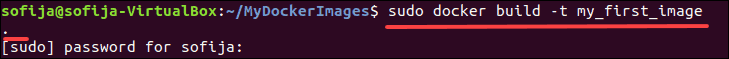

# Steps to Create Docker Image with Dockerfile

## Prerequisites

1. A Linux system
2. Access to the command-line/terminal window
3. Access to a user account with root or sudo privileges
4. Docker installed and configured

## How to Create a Dockerfile

1. The first thing you need to do is to create a directory in which you can store all the Docker images you build.

```shell
mkdir MyDockerImages
cd MyDockerImages
```

2. Create a new empty file (Dockerfile)

```shell
touch Dockerfile
```

3. Edit the Dockerfile with following content:

```shell
FROM ubuntu

MAINTAINER sofija

RUN apt-get update

CMD ["echo", "Hello World"]
```

**FROM** – Defines the base of the image you are creating. You can start from a parent image (as in the example above) or a base image. When using a parent image, you are using an existing image on which you base a new one. Using a base image means you are starting from scratch (which is exactly how you would define it: FROM scratch).

**MAINTAINER** – Specifies the author of the image. Here you can type in your first and/or last name (or even add an email address). You could also use the LABEL instruction to add metadata to an image.

**RUN** – Instructions to execute a command while building an image in a layer on top of it. In this example, the system searches for repository updates once it starts building the Docker image. You can have more than one RUN instruction in a Dockerfile.

**CMD** – There can be only one CMD instruction inside a Dockerfile. Its purpose is to provide defaults for an executing container. With it, you set a default command. The system will execute it if you run a container without specifying a command.

## Build a Docker Image with Dockerfile

The basic syntax used to build an image using a Dockerfile is:

```shell
docker build [OPTIONS] PATH | URL | -
```

To build a docker image, you would therefore use:

```shell
docker build .
```

By adding the **-t** flag, you can tag the new image with a name which will help you when dealing with multiple images:

```shell
docker build -t my_first_image .
```



```shell
sudo docker build -f Dockerfile.tf2.4.2-gpu  . -t kumarvishal01/tf2.4-gpu:v0.0.1 --rm
```
