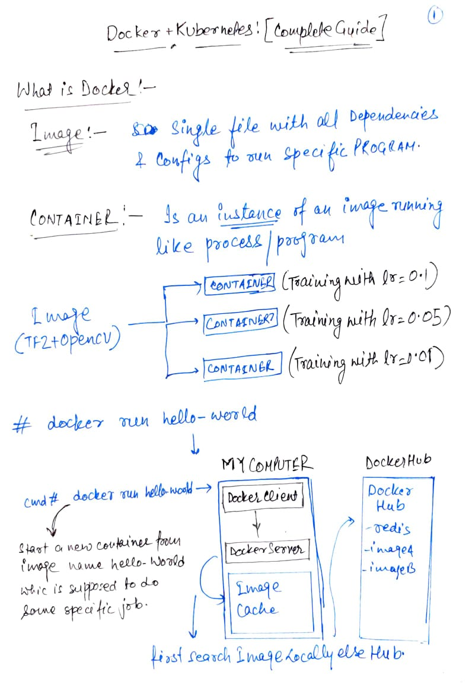
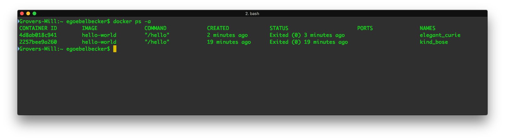
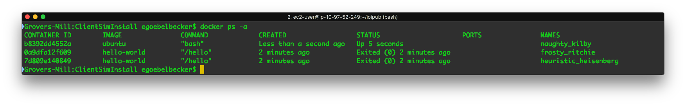
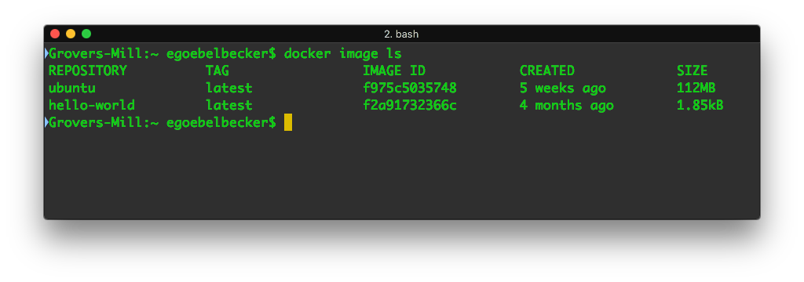
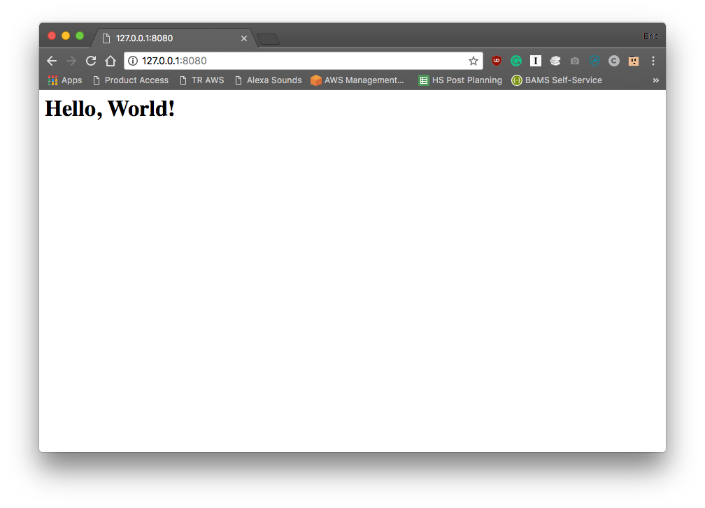
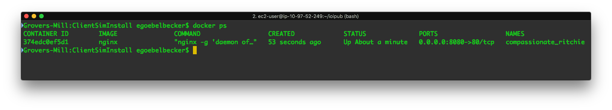
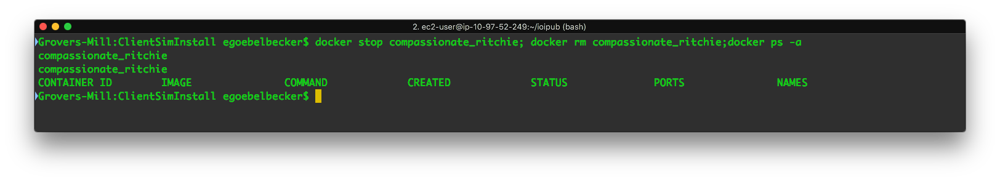

# Dcoker Quick Rampup



**Understanding Docker Commands**
----------------------------------

### Running a container

```shell
docker run hello-world
```

*docker run hello-world* does  it runs an image named “hello-world" create container. Docker looks for this image on our local system. When it can’t find the image, Docker downloads it from Docker Hub for us.

### Lists the containers on our system

```shell
docker ps -a(list of all containers on the system ever)
docker ps(list of running containers)
```



We see two stopped instances of hello-world, with two different names. Docker created an additional container. It didn’t reuse the first. When we told Docker to run an image named hello-world, it did exactly that; it ran a new instance of the image. *If we want to reuse a container, we refer to it by name.*

### Reuse a container

```shell
docker start –attach <container name>
docker start –attach kind_base
```

This time, we used docker start –attach <container name> instead of docker run. We use the start command, and rather than naming the image, we specify the name of a container that’s already loaded. The –attach tells Docker to connect to the container output so we can see the results.

### Interactive Shell

```shell
docker run -it ubuntu bash
```

*docker run -it ubuntu bash*, we downloaded an Ubuntu Linux image and started a login shell as root inside it. The **-it flags** allow us to interact with the shell. When we open another window and list containers, we see a different picture:



### Listing of images on our system

```shell
docker image ls
```



### Share system resources with a container

Docker has the ability to share both the file system and the networking stack with containers. Let’s create a web server that serves a web page from the local filesystem. We’ll use a public Nginx image.

```shell
docker run -v /full/path/to/html/directory:/usr/share/nginx/html:ro -p 8080:80 -d nginx
```

1. **-v /full/path/to/html/directory:/usr/share/nginx/html:ro** maps the directory holding our web page to the required location in the image. The ro field instructs Docker to mount it in **read-only mode**. It’s best to pass Docker the full paths when specifying host directories.

2. **-p 8080:80** maps network service port 80 in the container to 8080 on our host system.(Port forwarding)

3. **-d** detaches the container from our command line session. Unlike our previous two examples, we don’t want to interact with this container.

4. nginx image name

After executing this command, we should be able to reach the web server on <ins> *port 8080* </ins>.



When we ran the Nginx image, we needed to tell it where to get the web files. We did this by mounting a directory on our host system to a directory inside the container, overriding the files that are already inside the image. Docker also supports volumes, which can contain filesystems and be shared between containers.

We also needed to map port 80 in our container to a port on our host system so the web server can communicate with the outside world. Containers don’t automatically have access to the host network. With our port mapping directive, the container can be accessed via the host network. Since we only mapped this port, no other network resources are available to the container.

### Stop and remove a container



Our web server is still running:

```shell
docker stop compassionate_ritchie(stop container)
docker rm compassionate_ritchie(remove container)
```

After running these two commands, the container is gone.




