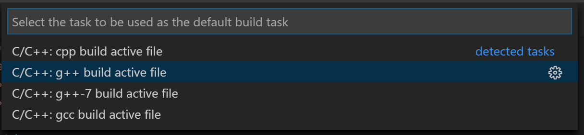
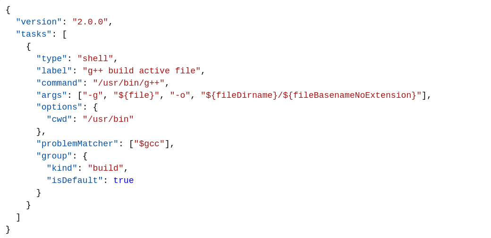

# VSCode-4-C++

## VSCode-On-Linux

1. Ensure g++ is installed.

2. Install the GNU compiler tools and the GDB debugger with below command.

```
sudo apt-get install build-essential gdb
```

### <ins> Create Hello World: </ins>

Create a folder called helloworld, navigate into it, and open VS Code in that folder by entering the following commands:

```
cd projects
mkdir helloworld
cd helloworld
code .
```

The **code .** command opens VS Code in the current working folder, which becomes your "workspace". As you go through the tutorial, you will create three files in a .vscode folder in the workspace:

1. tasks.json **(compiler build settings)**
2. launch.json **(debugger settings)**
3. c_cpp_properties.json **(compiler path and IntelliSense settings)**

### <ins> Build *helloworld.cpp*: </ins>

1. create a **tasks.json** file to tell VS Code how to build (compile) the program. This task will invoke the g++ compiler to create an executable file from the source code.

2. It's important to have **helloworld.cpp** open in the editor because the next step uses the active file in the editor for context to create the build task in the next step.

3. From the main menu, choose Terminal > Configure Default Build Task. A dropdown appears showing various predefined build tasks for C++ compilers. **Choose C/C++: g++ build active file.** Refer image below.



New tasks.json file should look similar to the JSON below:



Details *task.json* variables in the [variables reference](https://code.visualstudio.com/docs/editor/variables-reference).

Few examples:

1. The **command** setting specifies the program to run; in this case that is g++.

2. The **args** array specifies the command-line arguments that will be passed to g++. These arguments must be specified in the order expected by the compiler.

