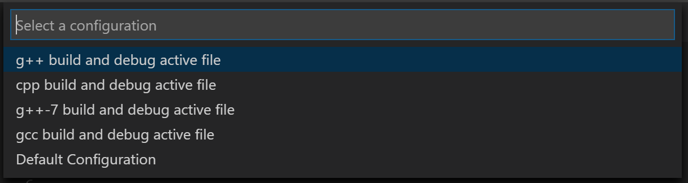

# VSCode-4-C++

## VSCode-On-Linux

1. Ensure g++ is installed.

2. Install the GNU compiler tools and the GDB debugger with below command.

```
sudo apt-get install build-essential gdb
```

### <ins> Create Hello World: </ins>

Create a folder called helloworld, navigate into it, and open VS Code in that folder by entering the following commands:

```
cd projects
mkdir helloworld
cd helloworld
code .
```

The **code .** command opens VS Code in the current working folder, which becomes your "workspace". As you go through the tutorial, you will create three files in a .vscode folder in the workspace:

1. tasks.json **(compiler build settings)**
2. launch.json **(debugger settings)**
3. c_cpp_properties.json **(compiler path and IntelliSense settings)**

### <ins> Build *helloworld.cpp*: </ins>

1. create a **tasks.json** file to tell VS Code how to build (compile) the program. This task will invoke the g++ compiler to create an executable file from the source code.

2. It's important to have **helloworld.cpp** open in the editor because the next step uses the active file in the editor for context to create the build task in the next step.

3. From the main menu, choose Terminal > Configure Default Build Task. A dropdown appears showing various predefined build tasks for C++ compilers. **Choose C/C++: g++ build active file.** Refer image below.


New tasks.json file should look similar to the JSON below:


Details *task.json* variables in the [variables reference](https://code.visualstudio.com/docs/editor/variables-reference).

Few examples:

1. The &#x1F538;**command**&#x1F538; setting specifies the program to run; in this case that is g++.

2. The &#x1F538;**args**&#x1F538; array specifies the command-line arguments that will be passed to g++. These arguments must be specified in the order expected by the compiler.

3. This task tells g++ to take the active file &#x1F539;(${file})&#x1F539;, compile it, and create an executable file in the current directory &#x1F539;(${fileDirname})&#x1F539; with the same name as the active file but without an extension &#x1F539;(${fileBasenameNoExtension})&#x1F539;, resulting in helloworld for our example.

4. To run the build task defined in tasks.json, press ```Ctrl+Shift+B``` or from the ```Terminal main menu choose Run Build Task```.

### <ins> Debug Hello World: </ins>

1. Create a ```launch.json``` file to &#x1F539;<ins>configure VS Code to launch the GDB debugger when you press F5 to debug the program</ins>&#x1F539;.

2. From the main menu, choose Run > Add Configuration... and then choose C++ (GDB/LLDB).



3. VS Code creates a ```launch.json``` file, opens it in the editor, and builds and runs 'helloworld'. 


4. In the JSON above, program specifies the program you want to debug. Here it is set to the active file folder ${fileDirname} and active filename without an extension ${fileBasenameNoExtension}, which if helloworld.cpp is the active file will be helloworld

5. Change the ```stopAtEntry``` value to true to cause the debugger to stop on the main method when you start debugging.

## ```References:```

1. [Using C++ on Linux in VS Code](https://code.visualstudio.com/docs/cpp/config-linux)

2. [Emojis in MD files](https://stackoverflow.com/questions/23904274/is-there-a-way-to-get-colored-text-in-github-flavored-markdown/41043795)
